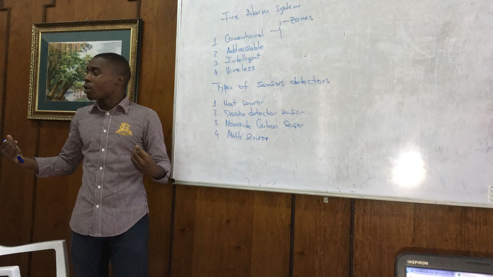
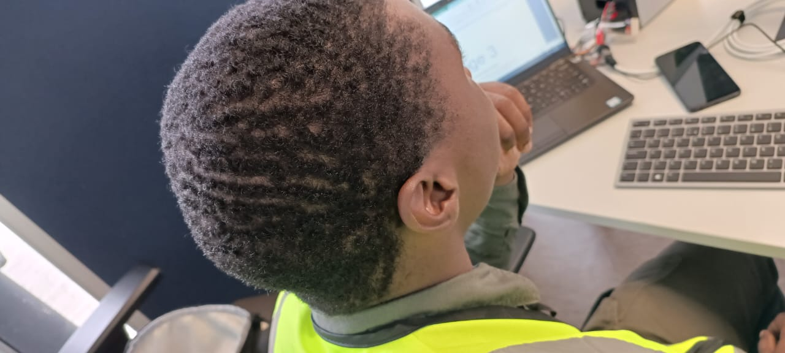
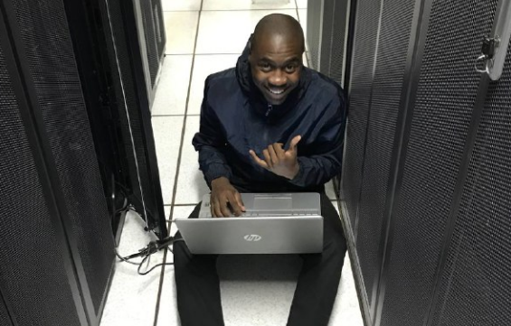
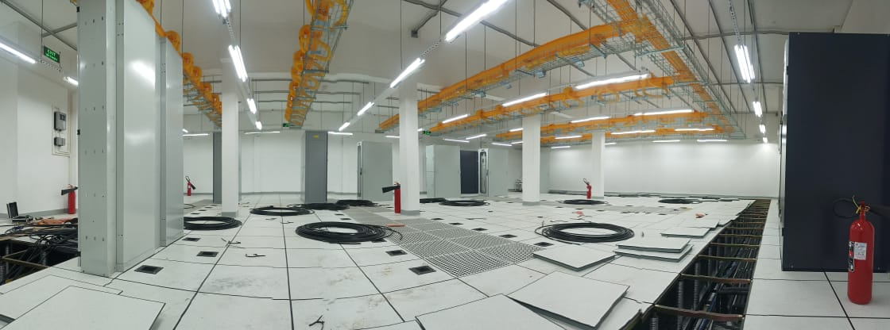
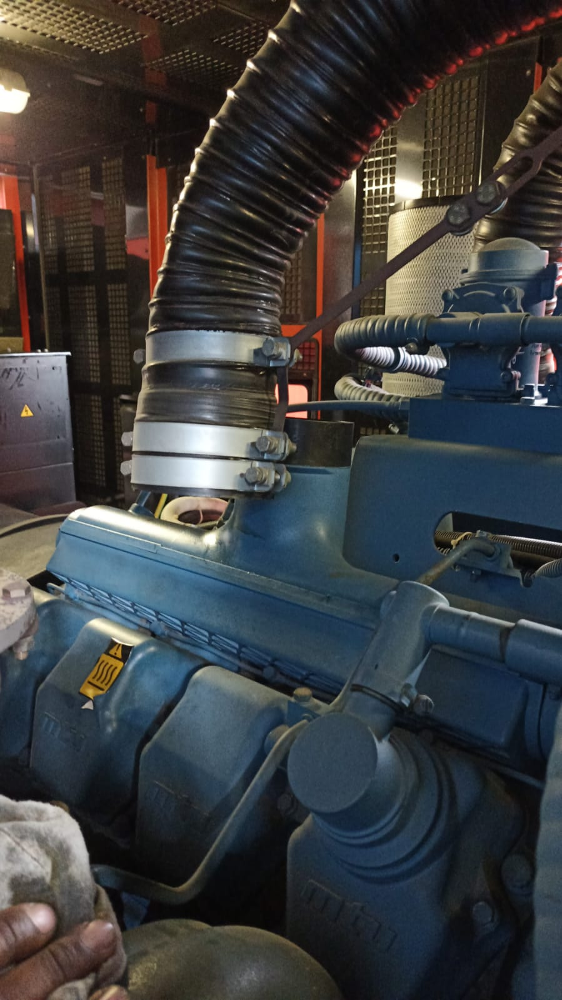
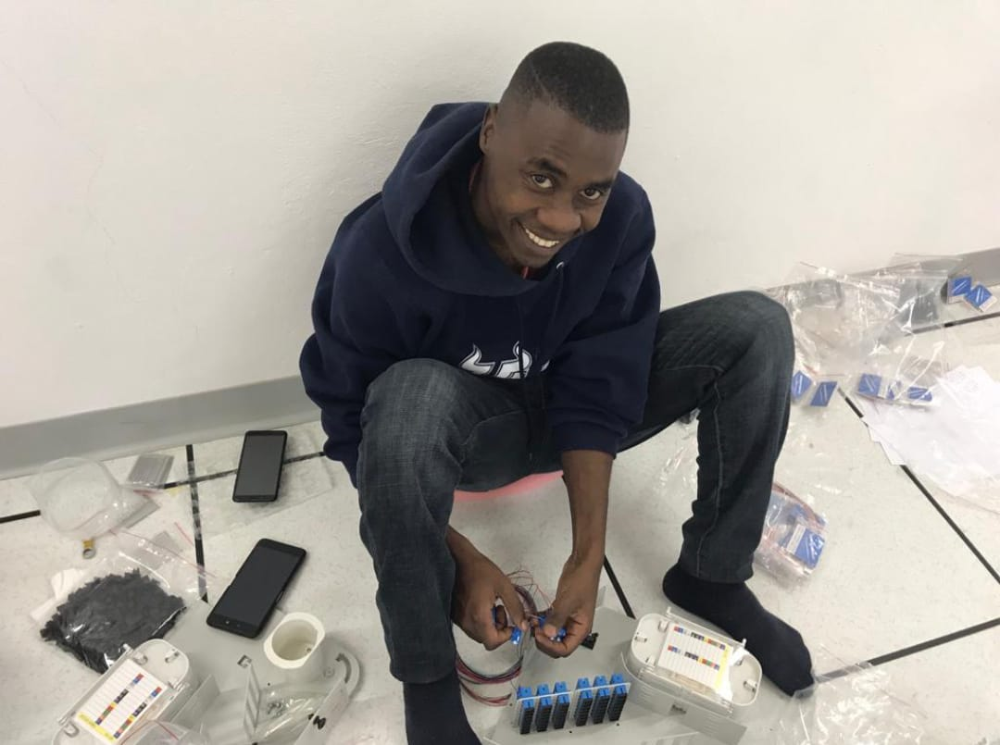

# 👋 Hi, I'm Filipe Chau

### **Electronic & Telecommunication Engineer | Data Center & Access Control Specialist**

I'm a Mozambican engineer with a strong background in **data center operations**, **access control systems**, and **electronic security**, particularly in high-stakes environments like **Mozambique LNG** and **Tier IV Data Center**.

🔐 Over the last few years, I've worked in critical operations across sectors such as Oil & Gas and Telecommunications, ensuring secure, high-availability infrastructure.

🧠 I'm currently working toward a **senior-level engineering role** by combining my hands-on field expertise with continuous learning in **AI** and **Cloud computing**.

## 🛠️ My Core Skills

- **Data Center Engineering**: Tier IV uptime, Power Systems, HVAC, UPS, Rectifiers
- **Access Control & Security**: Biometric, RFID, CCTV, Firewalls
- **Network & Systems**: Windows/Linux, Network Infrastructure
- **Programming**: Python, Bash scripting, Automation
- **Cloud & Virtualization**: AWS, VMware basics
- **Project Management**: Agile methodologies, Cross-functional team leadership
- **Problem-Solving & Teamwork**: Proven ability in crisis response, training, and cross-functional collaboration

## 📌 Highlight Projects

Here are a few projects I've built just for fun and learning, available in my GitHub repos:
- 🖥️ **Genset - Dimensionador de Gerador** – [View on GitHub](https://github.com/ifilipechau/genset_app)
- 🌐 **Personal Portfolio Website** – [Live here](https://filipe-chau.github.io/MyPortfolio/)
- 💻 **Website - Electro-s** – [Live here](https://https://electro-s.co.mz/)

> I'm always experimenting and building—check the pinned repositories to explore more.

## ✍️ My Blog Posts

I also write about engineering concepts, lessons from the field, and emerging tech topics:

📖 [My Blogger Articles](https://mozitroom.blogspot.com/search/label/filipe-chau)

Some of my recent posts:
- [Episódio 5: Como o Data Center Me Preparou Para Qualquer Missão](https://mozitroom.blogspot.com/2025/07/episodio-6-como-o-data-center-me.html)
- [Episódio 4: Incidentes Que Testaram Nossos Limites (e o que aprendemos com eles)](https://mozitroom.blogspot.com/2025/07/episodio-4-incidentes-que-testaram.html)
- [Episódio 3: A rotina de operação e o monitoramento de um data center](https://mozitroom.blogspot.com/2025/06/episodio-3-rotina-de-operacao-e-o.html)
- [Episódio 2: Sistemas e equipamentos vitais no Data Center](https://mozitroom.blogspot.com/2025/06/episodio-2-sistemas-e-equipamentos.html)
- [Episódio 1: O que é um Data Center e como tudo começa](https://mozitroom.blogspot.com/2025/06/episodio-1-o-que-e-um-data-center-e.html)

*(More blog links coming soon !)*

## 🖼️ Field Gallery – My Work in Action

Below are a few snapshots from the field — working with infrastructure, security systems, and critical facilities across Mozambique LNG and Movitel:

<table>
  <tr>
    <td></td>
    <td></td>
    <td></td>
  </tr>
  <tr>
    <td align="center">Conducting a training session on the Fire Alarm</td>
    <td align="center">Managing Genetec Access Control Systems on site</td>
    <td align="center">Testing server connectivity and network</td>
  </tr>
</table>

<table>
  <tr>
    <td></td>
    <td></td>
    <td></td>
  </tr>
  <tr>
    <td align="center">Initial setup of the second server room</td>
    <td align="center">Mozambique LNG Project (processing unit)</td>
    <td align="center">Inspecting genset conditions prior to startup</td>
  </tr>
</table>

> 📸 These are just a few moments.

## 📫 Connect with Me

- 📧 Email: [filipechau@outlook.pt](mailto:filipechau@outlook.pt)
- 🌐 LinkedIn: [linkedin.com/in/filipe-chau-b25820211](https://www.linkedin.com/in/filipe-chau-b25820211)
- 🌍 Portfolio: [filipe-chau.github.io/MyPortfolio](https://filipe-chau.github.io/MyPortfolio)
- 📍 Location: Maputo, Mozambique

## 🎯 Next Steps
I'm actively seeking opportunities to grow into a **senior engineering role** where I can leverage my skills in:
- Data center operations and design
- Access control and security systems
- Cloud computing and AI integration
- Project management and team leadership

If you're working on something exciting or hiring, feel free to reach out!

> ⚡ “I don’t wait to be ready to act—I act to be ready.”

